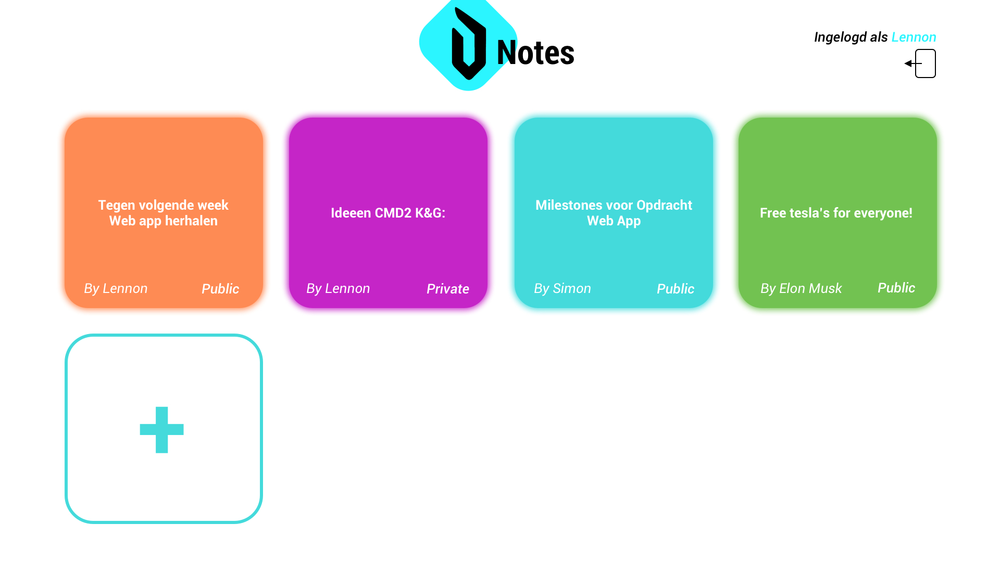
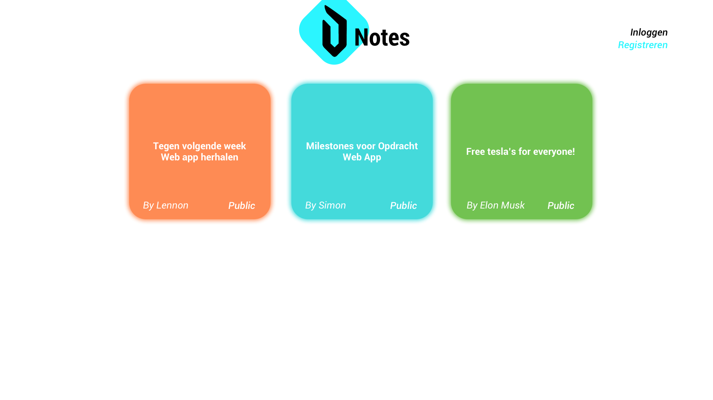
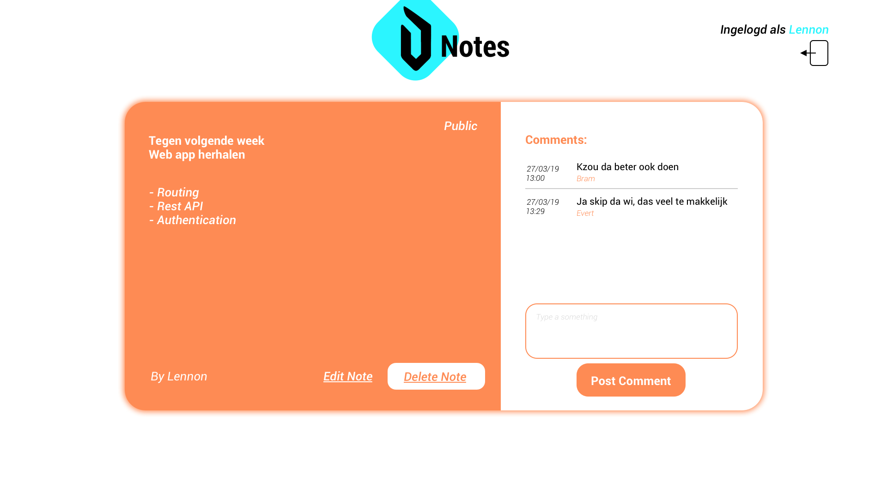

# WAD opdracht 2019

<a href="https://devinenotes2.herokuapp.com/">https://devinenotes2.herokuapp.com/</a>

Voor Web App Development moeten we een React project maken waarbij verwacht word dat we volgens de CRUD principes een volledig werkend project maken waarbij we de geziene dingen op toepassen zoals de REST API, Authentication, etc.

<h1>Devine Notes</h1>

De bedoeling van deze Web Applicatie is dat je Notities kunt maken voor jezelf of anderen aan ergens kunt herinneren.

Je kan inloggen nadat je je hebt geregistreerd om zo toegang te krijgen tot het maken van notities & reageren op notities van jezelf of anderen. Als je niet bent ingelogd kan je enkel notities bekijken die publiek zijn gemaakt.

<h2>Wat zijn de features van de Notes?</h2>
<ul>
	<li>Je kunt inloggen/registreren</li>
    <li>Je kan doorklikken naar een detailpagina van een note voor meer info te krijgen</li>
    <li>Je kan reacties plaatsen op een notitie</li>
    <li>Je krijgt bij het plaatsen van een notitie de optie om deze publiek of privaat in te stellen</li>
    <li>Je kan je eigen notitie veranderen/verwijderen</li>
</ul>

<h2>Design</h2>

Ik had tijdens het brainstormen gedacht aan post-it blaadjes dus wil ik dit een beetje verwerken in dit project door verschillende kleuren te gebruiken voor een notitie, er zullen 4 basis kleuren zijn en de computer zal kiezen welke kleur het zal zijn bij het creëren van een notitie

De afgeronde hoeken worden overal behouden & uiteindelijk zal de kleur van de detail ook afhangen van de kleur van de notitie en zal dit kleur samen met wit worden gecombineerd

<h4>Overzichtpagina - ingelogd</h4>

 
<h4>Overzichtpagina - uitgelogd</h4>

 
<h4>Detailpagina Notitie</h4>

